.. -*- mode: rst; coding: utf-8-unix -*-

クライアントのインストールと設定 (Linux版)
============================================

1. ダウンロード
----------------

(1).Qt Brynhildrのダウンロード
^^^^^^^^^^^^^^^^^^^^^^^^^^^^^^

 以下からダウンロードします。

 <https://github.com/funfun-dc5/qtbrynhildr/releases>

 [64bit版]

   QtBrynhildr-linux_x64-v100.run

 [32bit版]

   QtBrynhildr-linux_x86-v100.run

(2).Qt5のダウンロード
^^^^^^^^^^^^^^^^^^^^^
 [64bit版 Qt5.6.1]

 <http://download.qt.io/archive/qt/5.6/5.6.1/qt-opensource-linux-x64-5.6.1.run>

 [32bit版 Qt5.4.2]

 <http://download.qt.io/archive/qt/5.4/5.4.2/qt-opensource-linux-x86-5.4.2.run>

2. Qt5のインストール
--------------------------

(1) インストーラ起動
^^^^^^^^^^^^^^^^^^^^
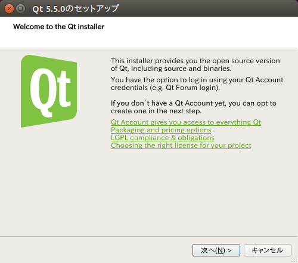

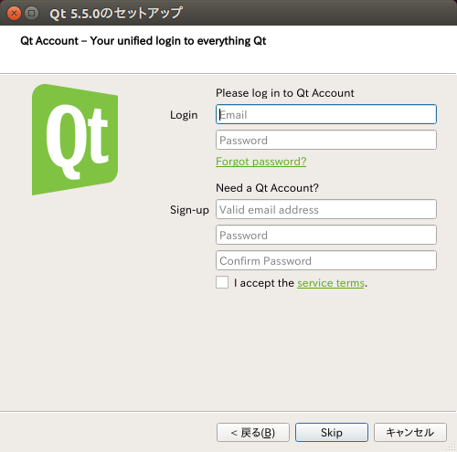

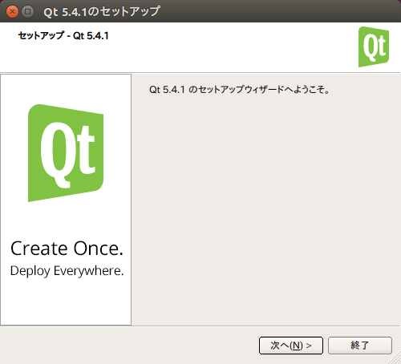

(2) インストール先の選択
^^^^^^^^^^^^^^^^^^^^^^^^^
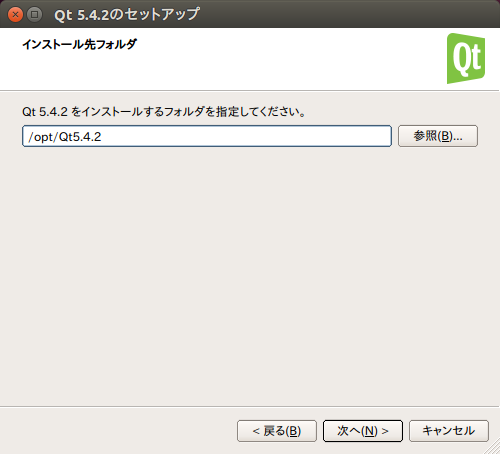

(3) コンポーネントの選択
^^^^^^^^^^^^^^^^^^^^^^^^^
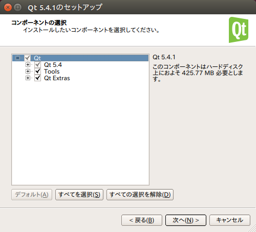

(4) ライセンス条項の同意
^^^^^^^^^^^^^^^^^^^^^^^^^
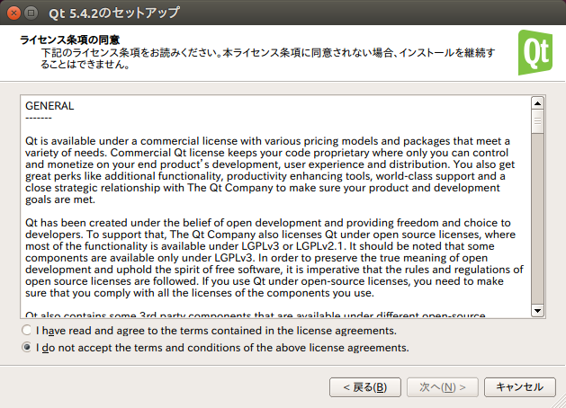

「同意する」を選択してください。

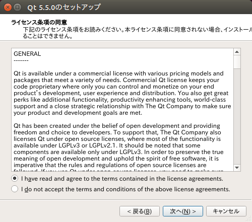

(5) インストールの準備完了
^^^^^^^^^^^^^^^^^^^^^^^^^^
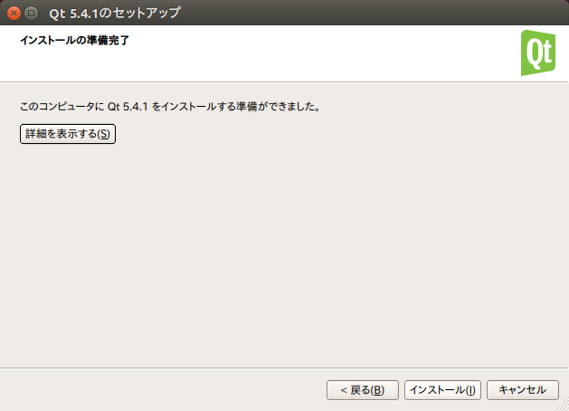

(6) インストール
^^^^^^^^^^^^^^^^
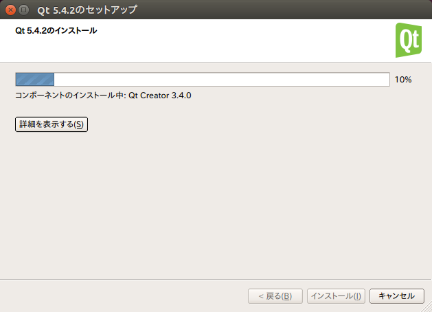

(7) インストール完了
^^^^^^^^^^^^^^^^^^^^
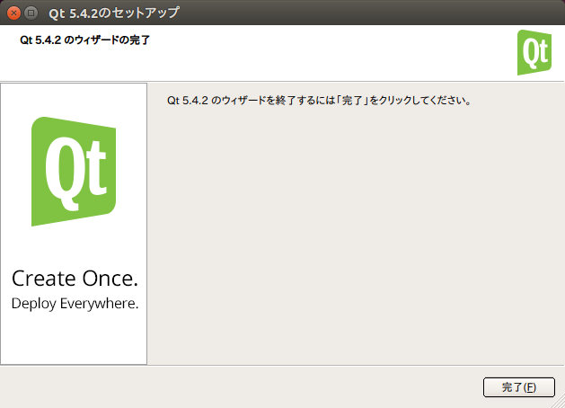

3. Qt5のアンインストール
------------------------

(1) メンテナンスツール起動
^^^^^^^^^^^^^^^^^^^^^^^^^^^

root権限でQt5.x.x/MaintenanceToolを実行してください。

..
 image:: images/ubuntu_uninstaller0.png

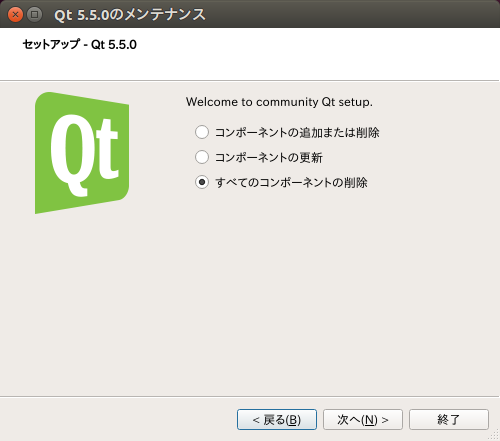

(2) アンインストールの準備完了
^^^^^^^^^^^^^^^^^^^^^^^^^^^^^^
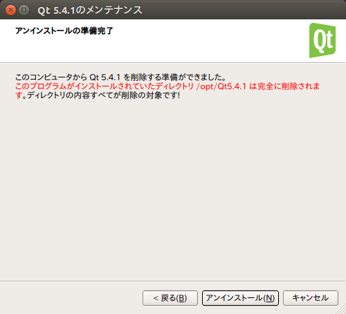

(3) アンインストール
^^^^^^^^^^^^^^^^^^^^
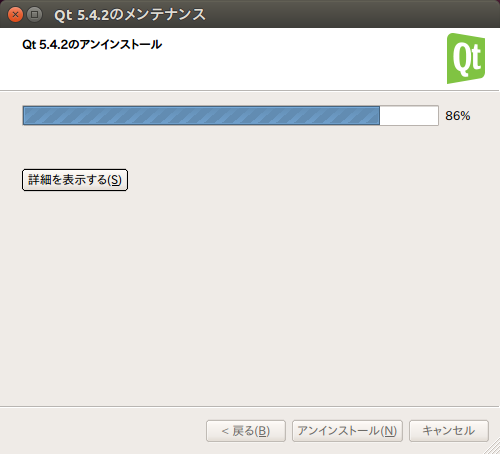

(4) アンインストール完了
^^^^^^^^^^^^^^^^^^^^^^^^^
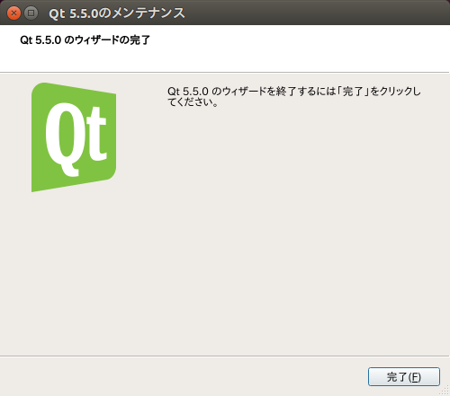

4. Qt Brynhildrのインストール
------------------------------

 自己解凍ファイルは以下のようにして展開します。 ::

  funfun@ubuntu-PC-x64:~$ chmod 500 ./QtBrynhildr-linux_x64-v100.run
  funfun@ubuntu-PC-x64:~$ ./QtBrynhildr-linux_x64-v100.run
  UnZipSFX 5.52 of 28 February 2005, by Info-ZIP (http://www.info-zip.org).
   creating: linux_x64/
   creating: linux_x64/bin/
  inflating: linux_x64/bin/QtBrynhildr
   creating: linux_x64/doc/
  inflating: linux_x64/doc/LICENSE.txt
   creating: linux_x64/doc/manual/
   creating: linux_x64/doc/manual/doctrees/
  inflating: linux_x64/doc/manual/doctrees/port_forwarding.doctree

  :
  略
  :

  inflating: linux_x64/doc/manual/html/index.html
  inflating: linux_x64/doc/manual/html/genindex.html
  inflating: linux_x64/doc/ReadMe.txt

5. Qt Brynhildrのアンインストール
----------------------------------

 以下のようにして展開したディレクトリと設定ファイルを含むディレクトリを手動で削除してください。 ::

  funfun@ubuntu-PC-x64:~$ rm -rf ./linux_x64
  funfun@ubuntu-PC-x64:~$ rm -rf ~/.config/mcz-xoxo

6. 起動/終了と設定ファイル
--------------------------

* 設定ファイル

  標準では以下のファイルに保存されます。 ::

   ~/.config/mcz-xoxo/Qt Brynhildr.ini

  オプションにファイル名を与えることで変更できます。

..
       Ubuntu 15.04でQtが5.4.1にアップデートされましたのでQt5のインストールは不要です。
       但しメニューの場所はシステム設定によって変わります。

       同じウィンドウにメニューバーを表示したい場合は、環境変数UBUNTU_MENUPROXYに0を設定して
       Qt Brynhildrを起動してください。Qt Brynhildr実行時だけ変えたい場合は例えば

       env UBUNTU_MENUPROXY=0 ./linux_x64/bin/QtBrynhildr

       という感じです。
