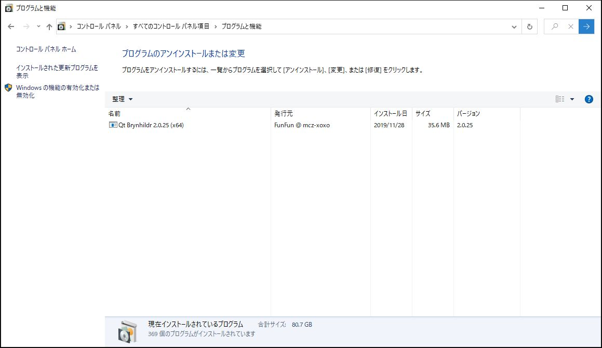

.. -*- mode: rst; coding: utf-8-unix -*-

クライアントのインストールと設定 (Windows版)
============================================

1. ダウンロード
---------------

(1) Qt Brynhildrのダウンロード
^^^^^^^^^^^^^^^^^^^^^^^^^^^^^^
 以下からダウンロードします。

 <https://github.com/funfun-dc5/qtbrynhildr/releases>

(2) Visual C++ Redistributable のダウンロード
^^^^^^^^^^^^^^^^^^^^^^^^^^^^^^^^^^^^^^^^^^^^^
 Windows版ではランタイムライブラリパッケージが必要な場合があります。

 Microsoftのサイト, 窓の杜 <https://forest.watch.impress.co.jp/> などから入手できます。

2. インストール
---------------

インストーラパッケージを実行します。インストールウィザードに従ってインストールします。

(1) 言語の選択
^^^^^^^^^^^^^^

「日本語」もしくは「English」を選択します。

(2) セットアップウィザードの開始
^^^^^^^^^^^^^^^^^^^^^^^^^^^^^^^^

(3) 使用許諾の同意
^^^^^^^^^^^^^^^^^^

「 同意する」を選択します。

(4) インストール先の指定
^^^^^^^^^^^^^^^^^^^^^^^^
 インストール先を指定します。

(5) プログラムグループの指定
^^^^^^^^^^^^^^^^^^^^^^^^^^^^
 登録するスタートアップメニューのグループを指定します。

(6) 追加タスクの選択
^^^^^^^^^^^^^^^^^^^^

 必要な作業にチェックを入れてください。

(7) インストール準備完了
^^^^^^^^^^^^^^^^^^^^^^^^

(8) セットアップウィザードの完了
^^^^^^^^^^^^^^^^^^^^^^^^^^^^^^^^
 ReadMe.txtを表示するか、すぐにQt Brynhildrを実行するかのチェックを確認してセットアップウィザードを完了します。

3. アンインストール
-------------------

(1) コントロールパネルから「プログラムと機能」を開く

(2) 「アンインストール」を実行する

 確認ダイアログが表示されます。

「アンインストール」が実行されます。

「アンインストール」が完了しました。

4. 起動/終了と設定ファイル
--------------------------

* 設定ファイル

  標準では以下のファイルに保存されます。::

   C:\Users\ユーザ名\AppData\Roaming\mcz-xoxo\Qt Brynhildr.ini

  オプションにファイル名を与えることで変更できます。
