.. -*- mode: rst; coding: utf-8-unix -*-

クライアントのインストールと設定 (Windows版)
============================================

1. ダウンロード
---------------

(1) Qt Brynhildrのダウンロード
^^^^^^^^^^^^^^^^^^^^^^^^^^^^^^

 すみません、まだダウンロード先は決まっていません。決まり次第追記します。

(2) Visual C++ 2010 x86 Redistributable のダウンロード
^^^^^^^^^^^^^^^^^^^^^^^^^^^^^^^^^^^^^^^^^^^^^^^^^^^^^^
 Windows版ではランタイムライブラリパッケージ

  Visual C++ 2010 x86 Redistributable

 が必要な場合があります。例えば以下から入手できます。

 <http://www.microsoft.com/ja-jp/download/details.aspx?id=8328>

2. インストール
---------------

(1) 言語の選択
^^^^^^^^^^^^^^
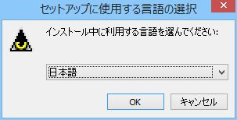

(2) セットアップウィザードの開始
^^^^^^^^^^^^^^^^^^^^^^^^^^^^^^^^
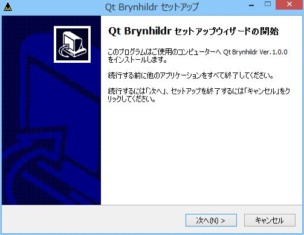

(3) 使用許諾の同意
^^^^^^^^^^^^^^^^^^
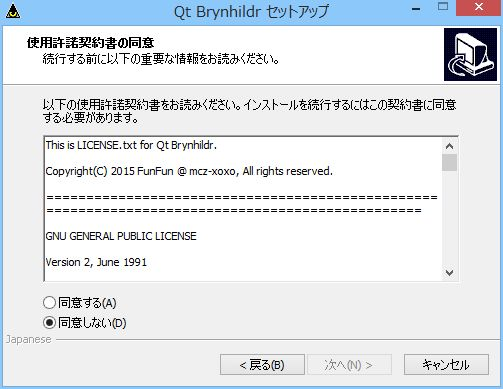

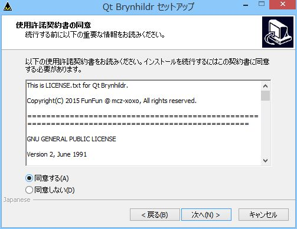

(4) インストール先の指定
^^^^^^^^^^^^^^^^^^^^^^^^
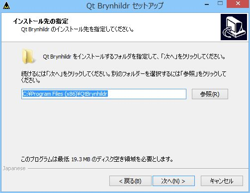

(5) プログラムグループの指定
^^^^^^^^^^^^^^^^^^^^^^^^^^^^
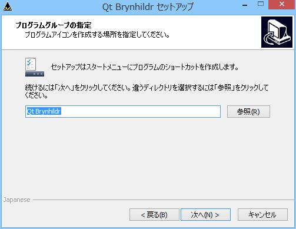

(6) 追加タスクの選択
^^^^^^^^^^^^^^^^^^^^
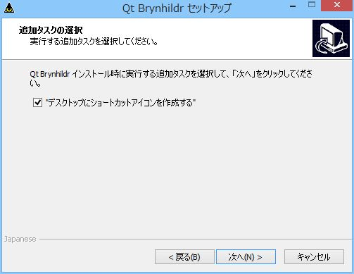

(7) インストール準備完了
^^^^^^^^^^^^^^^^^^^^^^^^
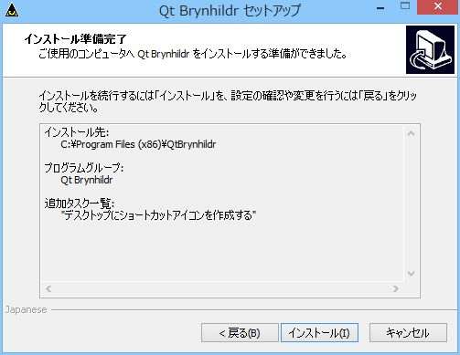

(8) セットアップウィザードの完了
^^^^^^^^^^^^^^^^^^^^^^^^^^^^^^^^
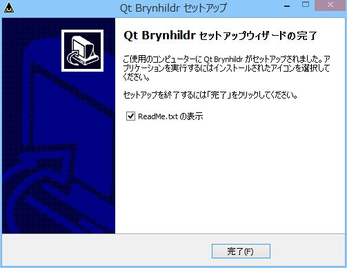

3. アンインストール
-------------------

(1) 「プログラムと機能」を開く

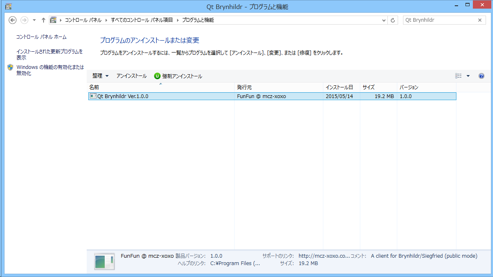

(2) 「アンインストール」を実行する

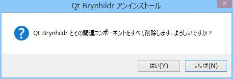

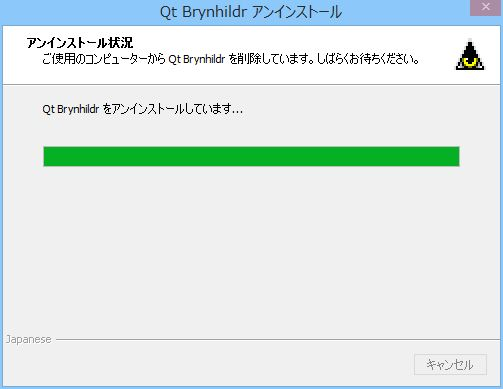

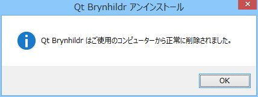

4. 起動/終了と設定ファイル
--------------------------

* 設定ファイル

  標準では以下のファイルに保存されます。::

   C:\Users\ユーザ名\AppData\Roaming\mcz-xoxo\Qt Brynhildr.ini

  オプションにファイル名を与えることで変更できます。
